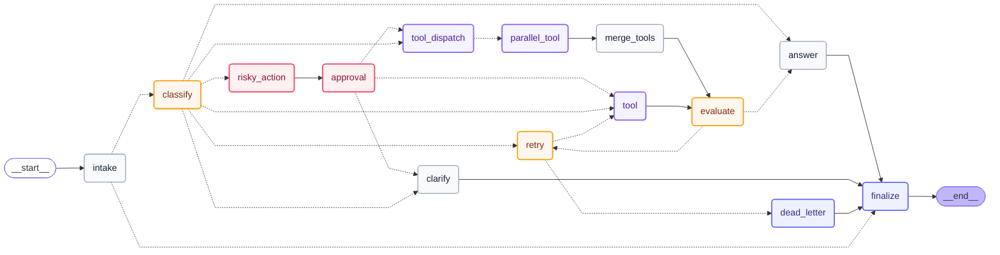
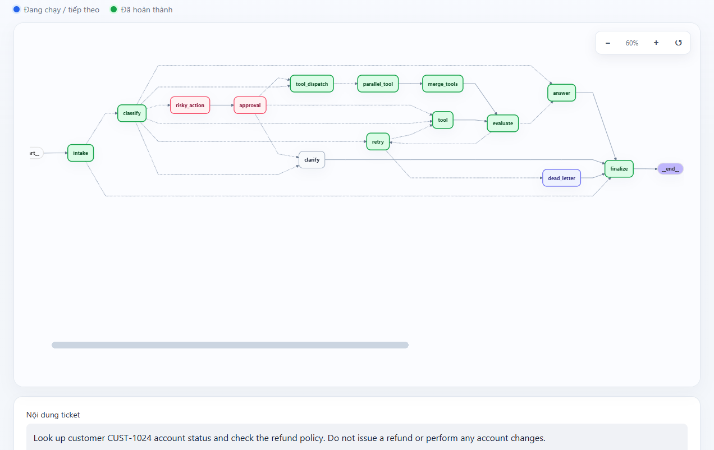
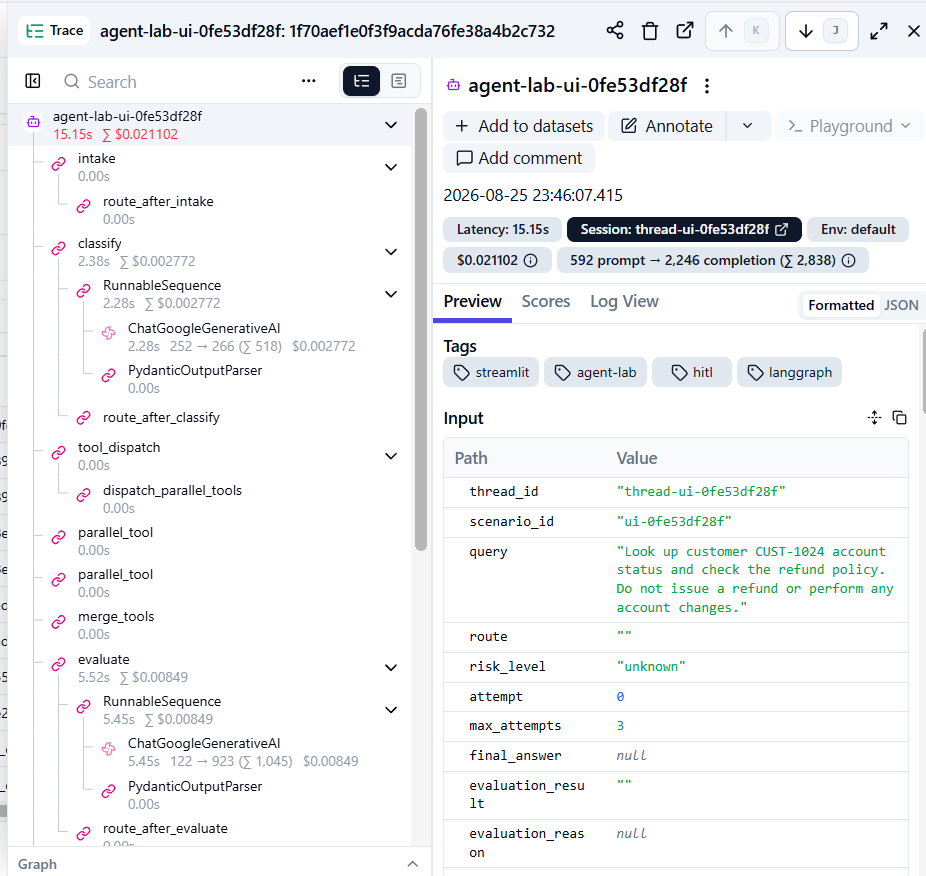
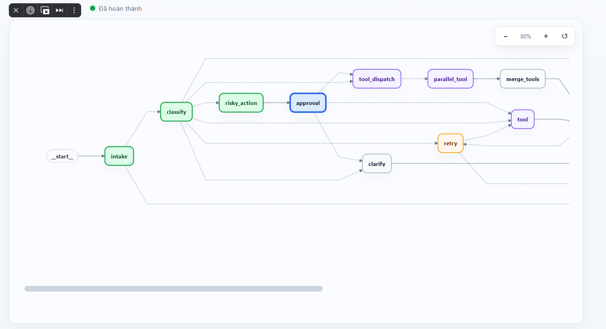
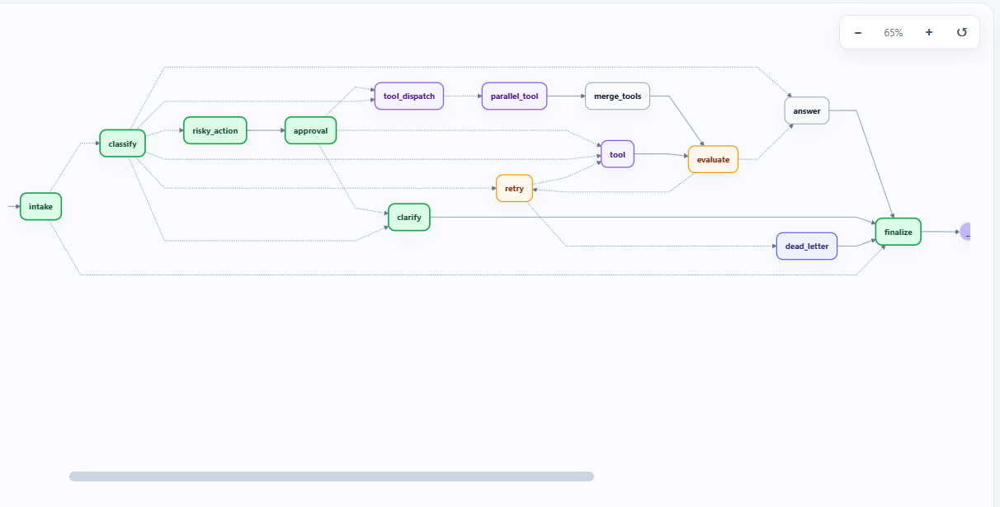
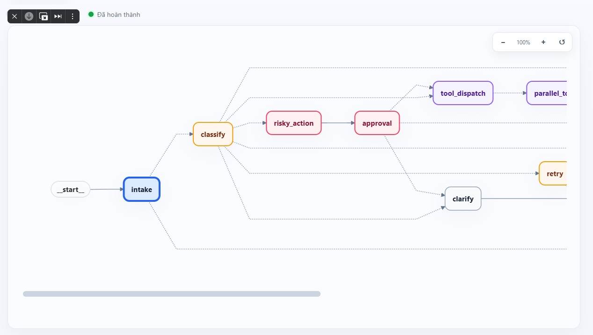

# Báo cáo Day 08 — LangGraph Agent Lab

## 1. Sinh viên

- Họ tên: Trương Ngọc Hải - 2A202601092
- Repository: `HaiTruong211200/phase2-k3-4-track3-day8-langgraph-agent`
- Commit đối chiếu: `6d8252d` cùng phần triển khai hiện tại trong working tree
- Ngày: 2026-08-25

## 2. Tổng hợp metrics

| Chỉ số | Giá trị |
|---|---:|
| Tổng số scenario | 7 |
| Scenario thành công | 7 |
| Tỷ lệ thành công | 100.00% |
| Số node trung bình | 6.43 |
| Tổng số retry | 3 |
| Tổng HITL interrupt thực | 0 |
| Đã chứng minh khôi phục persistence | Có |

## 3. Kiến trúc

Graph giữ mười một node core có trách nhiệm tách biệt: `intake`, `classify`, `tool`,
`evaluate`, `answer`, `clarify`, `risky_action`, `approval`, `retry`, `dead_letter` và
`finalize`. Cạnh `START -> intake` là cố định. Sau `intake`, guardrail quyết định dừng ở
`finalize` hoặc tiếp tục tới `classify`. Kết quả phân loại chọn nhánh trả lời trực tiếp,
gọi tool, hỏi bổ sung thông tin, hành động rủi ro hoặc lỗi ban đầu.

Nhánh tool đi theo `tool -> evaluate`; kết quả đánh giá chọn `answer` hoặc `retry`. Router
retry chỉ quay lại `tool` khi `attempt < max_attempts`, nếu không sẽ tới `dead_letter`.
Nhánh rủi ro đi theo `risky_action -> approval`; quyết định duyệt đi tới `tool`, còn từ
chối đi tới `clarify`. Ba node `answer`, `clarify` và `dead_letter` đều đi tới `finalize`,
sau đó là `END`. Vòng lặp duy nhất có biến đếm tăng đơn điệu và mọi nhánh khác đều có cạnh
kết thúc rõ ràng. Khi bật fan-out, graph dùng thêm ba node `tool_dispatch`,
`parallel_tool` và `merge_tools`; khi tắt flag, route core vẫn đi thẳng tới `tool`.

SQLite dùng một `thread_id` riêng cho từng scenario và từng batch run. Cách này cho phép
khôi phục từng bước nhưng không trộn lịch sử append-only của các lần benchmark khác nhau.

### 3.1 Graph thực tế xuất từ compiled graph

Sơ đồ dưới đây được lưu tại `reports/actual_graph.mmd` và sinh từ
`compiled_graph.get_graph().draw_mermaid()`. Test extension so sánh nguyên văn artifact với
compiled graph để phát hiện node hoặc edge bị lệch. Đường liền là fixed edge; đường nét đứt
là conditional edge. Layout trái sang phải phản ánh hướng thực thi, không có nghĩa mọi nhánh
đều chạy trong cùng một request.

## 4. State schema và reducer

| Trường | Cách cập nhật | Lý do |
|---|---|---|
| `query` | overwrite | Request hiện tại sau khi chuẩn hóa |
| `route` | overwrite | Route phân loại hoặc blocked hiện tại |
| `attempt` | overwrite | Bộ đếm retry hiện tại |
| `evaluation_result` | overwrite | Kết quả đánh giá tool mới nhất |
| `pending_question` | overwrite | Câu hỏi làm rõ hiện tại |
| `proposed_action` | overwrite | Hành động hiện chờ phê duyệt |
| `approval` | overwrite | Quyết định phê duyệt mới nhất |
| `security_blocked` | overwrite | Quyết định guardrail tại intake |
| `messages` | append | Lịch sử thông điệp/audit |
| `tool_results` | append | Lịch sử mọi lần gọi tool |
| `errors` | append | Lịch sử lỗi và retry |
| `events` | append | Audit trail theo từng node |

Các trường routing phải overwrite để router chỉ đọc quyết định mới nhất. Các trường lịch
sử dùng reducer `add` để không mất evidence qua retry hoặc checkpoint resume.

## 5. Kết quả scenario

| Scenario | Route mong đợi | Route thực tế | Thành công | Số node | Retry | HITL interrupt | Có approval | Độ trễ (ms) | Lỗi |
|---|---|---|---:|---:|---:|---:|---:|---:|---|
| S01_simple | simple | simple | Có | 4 | 0 | 0 | Không | 6620 | - |
| S02_tool | tool | tool | Có | 6 | 0 | 0 | Không | 4312 | - |
| S03_missing | missing_info | missing_info | Có | 4 | 0 | 0 | Không | 1718 | - |
| S04_risky | risky | risky | Có | 8 | 0 | 0 | Có | 4204 | - |
| S05_error | error | error | Có | 10 | 2 | 0 | Không | 4045 | Transient failure recorded; retry attempt 1; Transient failure recorded; retry attempt 2 |
| S06_delete | risky | risky | Có | 8 | 0 | 0 | Có | 4310 | - |
| S07_dead_letter | error | error | Có | 5 | 1 | 0 | Không | 1817 | Transient failure recorded; retry attempt 1; Maximum retry count reached after 1 attempt(s) |

Độ trễ là thời gian end-to-end đo bằng `perf_counter`, không phải latency riêng của từng
node hay LLM. `HITL interrupt` chỉ đếm interrupt thật, không đếm lượt qua mock approval.

## 6. Phân tích failure mode

### 6.1 Tool failure dẫn tới bounded retry hoặc dead-letter

- **Điểm phát sinh:** `tool_node` trả kết quả chứa `ERROR` cho route lỗi tạm thời khi
  `attempt < 2`.
- **Tín hiệu phát hiện:** `tool_results[-1]` giữ output lỗi; `evaluate_node` ghi đè
  `evaluation_result=needs_retry`; `events` ghi `tool:failed`, `evaluate:completed` và
  `retry:scheduled`; `errors` giữ số lần thử.
- **Graph đi tiếp:** `route_after_evaluate` chọn `retry`; node này tăng `attempt`, sau đó
  `route_after_retry` chọn gọi lại `tool` hoặc chuyển sang `dead_letter`.
- **Bảo đảm termination:** `attempt` tăng đơn điệu và cạnh retry chỉ được phép khi
  `attempt < max_attempts`. Khi chạm giới hạn, graph đi theo
  `dead_letter -> finalize -> END`.
- **Evidence thực tế:** số retry cuối là `S05_error`=2, `S07_dead_letter`=1. Scenario error thành công nghĩa là
  đi đúng route mong đợi, không có nghĩa thao tác tool cơ sở đã thành công.
- **Giới hạn:** tool và evaluator là mock; chưa phân biệt lỗi retryable/permanent, chưa có
  backoff và chưa bảo đảm idempotency cho side effect thật.

### 6.2 Risky action bị từ chối trước tool

- **Điểm phát sinh:** `classify_node` gán route `risky`; `risky_action_node` chỉ ghi
  `proposed_action`, chưa thực thi.
- **Tín hiệu phát hiện:** `risk_level=high`, event `risky_action:prepared` và
  `approval.approved` cung cấp tín hiệu routing cùng audit record.
- **Graph đi tiếp:** `approved=True` đi tới `tool`; từ chối hoặc thiếu quyết định đi tới
  `clarify`, vì vậy không chạm node tạo side effect.
- **Bảo đảm termination:** nhánh từ chối đi `clarify -> finalize -> END`; nhánh được duyệt
  nhập lại đường tool vốn đã có retry bound.
- **Evidence thực tế:** scenario cần approval ghi nhận `S04_risky`=đã ghi nhận, `S06_delete`=đã ghi nhận. Batch cuối dùng
  mock approval và có 0 HITL interrupt thật, nên chứng minh approval
  gate nhưng chưa chứng minh một lần từ chối tương tác.
- **Giới hạn:** mock approval mặc định `True`. Production cần reviewer được xác thực,
  pause/resume bền vững, authorization policy, expiry và tool idempotent.

### 6.3 Prompt injection tại intake

`intake` chuẩn hóa Unicode, loại control character, giới hạn độ dài và chặn các mẫu ghi đè
instruction, lấy cắp prompt, giả mạo role hoặc bypass safety. Input bị chặn đi thẳng
`intake -> finalize -> END`, không tới LLM. Giới hạn là rule-based detector vẫn có thể bỏ
sót obfuscation hoặc tạo false positive; production cần adversarial evaluation và moderation.

Kết quả cấp scenario: Không có scenario nào thất bại trong lần chạy cuối.

## 7. Evidence về persistence và recovery

`SqliteSaver` dùng WAL và `check_same_thread=False`. Mỗi batch thêm hậu tố ngẫu nhiên vào
`thread_id` để lịch sử cũ không làm sai metrics. Sau vòng scenario, CLI tạo **saver và graph
mới** trên cùng database, đọc scenario đầu bằng cùng `thread_id`, kiểm tra `scenario_id` và
yêu cầu ít nhất hai history snapshot trước khi đặt `resume_success=true`. Metrics cuối ghi
nhận phép kiểm tra này là **thành công**.

Test persistence độc lập đóng connection ban đầu, mở lại database bằng saver thứ hai, kiểm
tra state và xác nhận `get_state_history()` có nhiều snapshot. Evidence không chứa raw state,
credential hay secret. Kiểm thử chưa mô phỏng process bị kill khi external tool đang chạy.

## 8. Extension

Ngoài phần core, tôi đã làm thêm các phần sau:

- SQLite chạy ở chế độ WAL, có test đóng saver rồi mở lại và đọc state history.
- Guardrail chặn prompt injection trước khi request được chuyển tới LLM.
- Langfuse callback ghi trace theo `thread_id`, scenario và tag của lần chạy.
- LLM judge trả kết quả có cấu trúc. Nếu model timeout hoặc vượt giới hạn lần gọi, graph quay
  về evaluator heuristic.
- Fan-out tạo hai `Send()` cho `customer_context` và `policy_check`. Reducer sắp kết quả theo
  `tool_name` để output không thay đổi theo thứ tự worker trả về.
- HITL thật dùng interrupt và resume trên cùng `thread_id`.
- Giao diện Streamlit hiển thị graph, trạng thái approval, kết quả fan-out và event trail.

### 8.1 Lần chạy LLM judge và fan-out

Tôi chạy ticket: *“Look up customer CUST-1024 account status and check the refund policy.
Do not issue a refund or perform any account changes.”* Graph đi qua `tool_dispatch`,
`parallel_tool`, `merge_tools`, `evaluate`, `answer` rồi `finalize`. Đây là đường chạy mong đợi
khi bật cả fan-out và LLM judge.

Trong Langfuse, sau hai span `parallel_tool` là `merge_tools` và `evaluate`. Span `evaluate` có
lời gọi `ChatGoogleGenerativeAI` và bước parse bằng `PydanticOutputParser`. Vì vậy kết quả đánh
giá ở lần chạy này đến từ model, không phải evaluator heuristic. Langfuse hiển thị thời gian của
`evaluate` là khoảng 5,45 giây và chi phí 0,00849 USD. Toàn trace mất 15,15 giây, dùng 592
prompt token và 2.246 completion token. Tôi không dùng các số tổng này làm số đo riêng cho
fan-out.

Các test riêng kiểm tra ba trường hợp của judge: trả structured verdict, timeout rồi fallback và
dừng gọi model khi chạm cost guard. Test fan-out kiểm tra đủ hai kết quả `customer_context`,
`policy_check` và thứ tự merge ổn định.

Hai worker hiện chỉ là mock tool và trên trace đều có thời gian 0,00 giây. Vì chưa lưu thời điểm
bắt đầu/kết thúc của từng worker, lần chạy này mới chứng minh được fan-out bằng `Send()` và bước
merge, chưa đủ để kết luận hai tool có khoảng thời gian chạy chồng lên nhau.

### 8.2 Lần chạy HITL interrupt/resume

Ở lần chạy risky action, graph hoàn thành `intake`, `classify`, `risky_action` rồi dừng tại
`approval`. Node `tool` chưa chạy ở thời điểm này.

Tôi chọn reject và resume bằng đúng `thread_id` cũ. Graph tiếp tục qua `clarify` và `finalize`;
`tool` vẫn không được đánh dấu hoàn thành. Như vậy hành động bị chặn trước nơi thực hiện side
effect, đúng với route `approval -> clarify -> finalize`.

Ảnh dưới chụp lúc graph mới chạy: `intake` có viền xanh dương. Sau mỗi update, node đã đi qua
được chuyển sang màu xanh lá.

Các extension này không được bật trong batch metrics core để kết quả CI ổn định:

- LLM judge, fan-out và real interrupt được bật bằng flag; batch mặc định vẫn dùng evaluator,
  tool và approval mock của core.
- UI sinh Mermaid trực tiếp từ compiled graph; node đã chạy được tô xanh lá và node
  hiện tại/tiếp theo được tô xanh dương sau từng update của stream. Mermaid chỉ chứa
  tên node/edge, không nhúng query, credential hoặc raw event.

## 9. Kế hoạch cải thiện

Việc cần làm tiếp theo là thay mock tool bằng integration thật. Khi đó mỗi side effect cần có
xác thực và idempotency để resume không thực hiện cùng một thao tác hai lần. Phần retry cũng cần
phân biệt lỗi tạm thời với lỗi vĩnh viễn và thêm exponential backoff.

Metrics hiện chỉ đo thời gian end-to-end. Nếu tiếp tục phát triển, tôi sẽ ghi latency và thời
điểm bắt đầu/kết thúc cho từng node, đặc biệt là hai worker fan-out. Khi có các timestamp này mới
có thể kiểm tra hai tool có chạy chồng thời gian hay không. Tôi cũng cần thêm test kill process
trong lúc graph đang dừng ở approval để kiểm tra recovery sát với production hơn.
